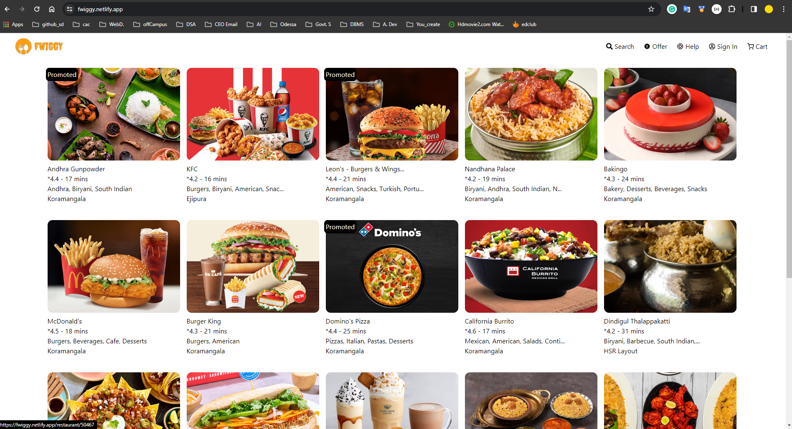
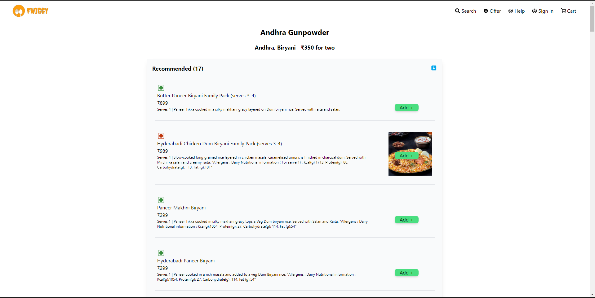
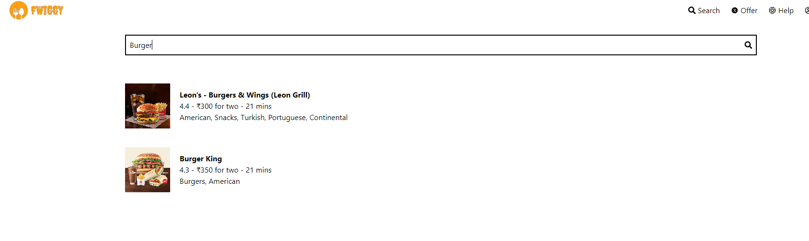

[THIS IS ONLY WORK IN DESKTOP]()

# Fwiggy - Swiggy Clone

Fwiggy is a React-based web application inspired by Swiggy, providing an interface to browse restaurants, view menus, and search food & restaurant. This project aims to replicate some features and the overall look and feel of the Swiggy platform.

## Table of Contents
- [Demo](#demo)
- [Features](#features)
- [Technologies Used](#technologies-used)
- [Installation](#installation)
- [Contributing](#contributing)
- [Screenshots](#screenshots)

## Demo

Check out the live demo: [Fwiggy](https://fwiggy.netlify.app/)

## Features

- Browse recommended restaurants
- View restaurant details and cuisines
- Search for restaurants
- Explore restaurant menus
- Offline support with notifications

## Technologies Used

- React
- React Router
- JavaScript (ES6+)
- HTML5
- CSS3
- TailwindCSS
- Netlify (for hosting)
- ...

##  Installation

1. Clone the repository:

$ git clone https://github.com/adarsh02raj/Fwiggy.git
$ cd Fwiggy

##  Contributing

Contributions are welcome! If you find any bugs or have suggestions for improvements, 
please [open an issue]() or [create a pull request]().

1. Install dependencies:

    $ npm install

2. Run the development server:

    $ npm start

Open your browser and [visit](http://localhost:3000) to view the application.


##  Screenshots


[](screenshot/image3.png)



```
